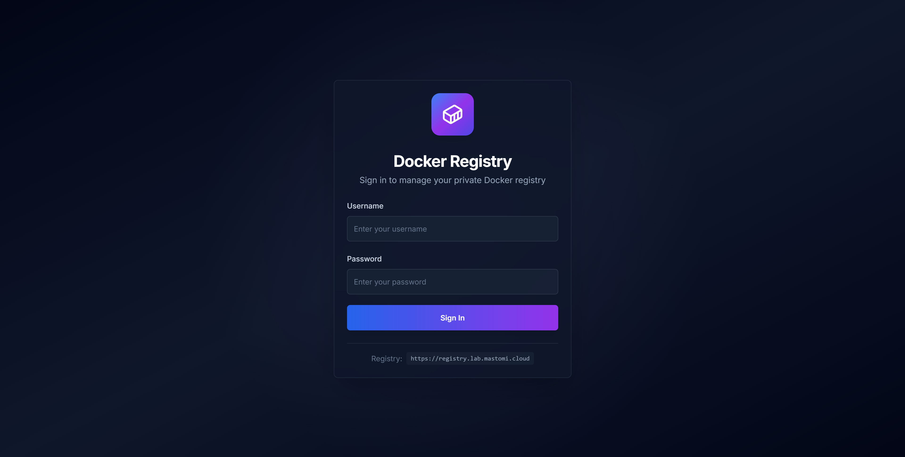
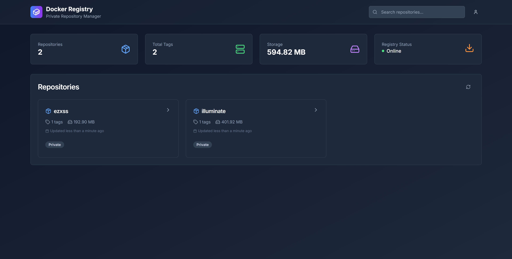
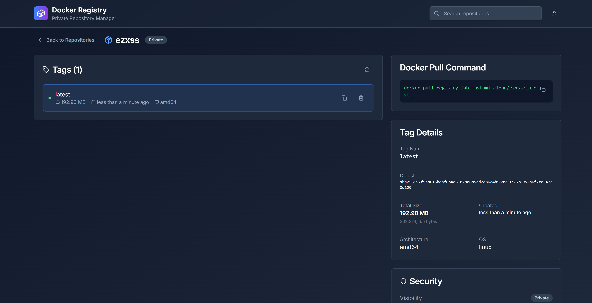

# 🐳 NEXT Registry UI

A lightweight web UI based on NextJS to manage your private **Docker Registry v2**, allowing you to browse repositories, view image details, check storage size, and delete images/tags directly.



  

  

---

## ✨ Features

- 🔐 Login with basic auth credentials
- 📦 List all repositories and their tags
- 📏 Display image size based on manifest layers
- 🗑️ Delete image tags/manifests safely
- 🔍 Search repositories
- 📊 Display statistics and storage usage

---

## 🚀 Getting Started

### 1. Clone this repository

```bash
git clone https://github.com/mastomii/next-registry-ui.git
cd next-registry-ui
```

### 2. Setup environment variables

Create a `.env.local` file in the root:

```env
# Docker Registry endpoint (accessible from the UI)
NEXT_PUBLIC_REGISTRY_HOST=http://your-private-registry-url

# Basic Auth credentials for internal server-side calls to the registry
REGISTRY_HOST=http://your-private-registry-url
REGISTRY_USER=user
REGISTRY_PASS=yout-strong-password
```

> If the Docker Registry runs on the host and the UI is in a container, use `http://host.docker.internal:5000`.

### 3. Install dependencies and start development server

```bash
npm install
npm run dev
```

Open your browser at: [http://localhost:3000](http://localhost:3000)

---

## 🔐 Authentication

The UI uses **Basic Auth** to connect to the Docker Registry.  
Your login credentials are stored in `localStorage` under the key `registry_auth` and sent with each request.

---

## 🧹 Cleaning Up: Garbage Collection

After deleting tags or manifests via UI, you should **manually run garbage collection** on the registry to free up space:

```bash
docker exec registry bin/registry garbage-collect /etc/distribution/config.yml
```

> Make sure `delete.enabled: true` is set in the registry's config file.

---

## 🐳 Example Docker Registry Setup

To start a private registry:

```bash
docker run -d   -p 5000:5000   --restart=always   --name registry   registry:2
```

If you want to enable deletion:

```yaml
# config.yml
storage:
  delete:
    enabled: true
```

Then mount this config and run the registry with:

```bash
docker run -d   -p 5000:5000   --restart=always   --name registry   -v $(pwd)/config.yml:/etc/docker/registry/config.yml   registry:2
```

---

### 🐳 Option 4: Run using Docker Compose

If you want to run this UI using Docker Compose, here's a basic example:

```yaml
services:
  registry:
    image: mastomi/next-registry-ui:latest
    restart: always
    environment:
      - NEXT_PUBLIC_REGISTRY_HOST=http://your-private-registry-url
      - REGISTRY_HOST=http://your-private-registry-url
      - REGISTRY_USER=your-private-registry-user
      - REGISTRY_PASS=your-private-registry-password
```

---